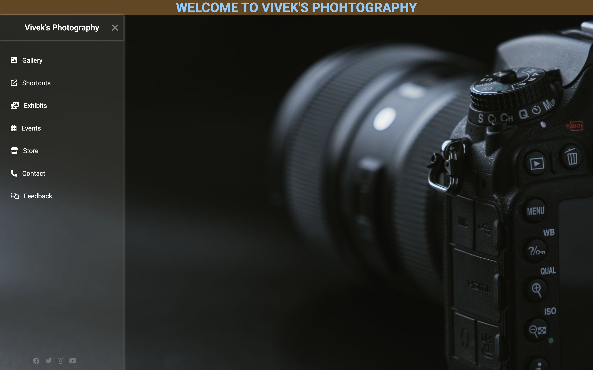

# Photography Portfolio Website

A modern, responsive photography portfolio website built using **HTML & CSS**.  
Perfect for showcasing your photos, portfolio, or creative work.

---

## 🔗 Live Demo
Check out the live project here:  
[🌐 Live Demo](https://vivekcode12345.github.io/css-mini-project/)

---

## 🖼 Screenshot
  


---

## ✨ Features
- Responsive sidebar navigation
- Modern, clean UI design
- Smooth hover effects and transitions
- Font Awesome icons for social links
- Fully responsive on desktop and mobile

---

## 🛠 Tech Stack
- HTML5  
- CSS3  
- Font Awesome (for icons)

---

## 🚀 How to Run Locally
1. Clone the repository:
   ```bash
   git clone https://github.com/vivekcode12345/css-mini-project.git
2. Open index.html in your browser.

   👤 Author

Vivek Verma
GitHub: @vivekcode12345
